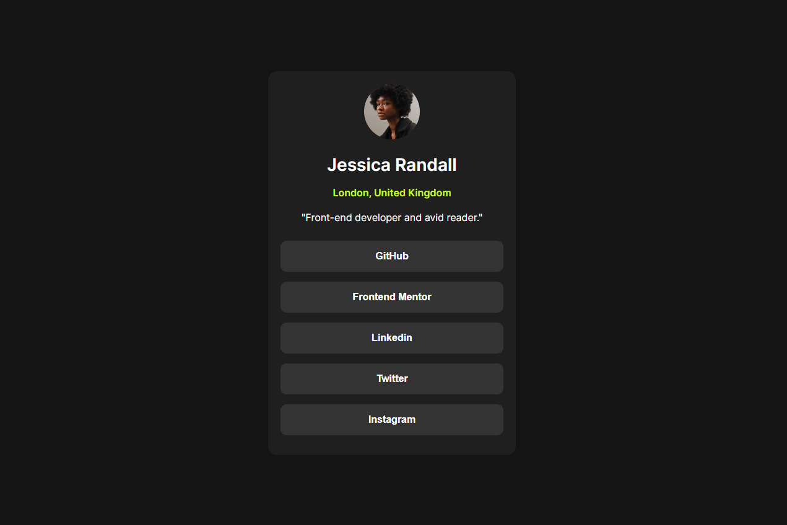

# Frontend Mentor - Social links profile solution

This is a solution to the [Social links profile challenge on Frontend Mentor](https://www.frontendmentor.io/challenges/social-links-profile-UG32l9m6dQ). Frontend Mentor challenges help you improve your coding skills by building realistic projects.

## Table of contents

- [Overview](#overview)
  - [The challenge](#the-challenge)
  - [Screenshot](#screenshot)
  - [Links](#links)
- [My process](#my-process)
  - [Built with](#built-with)
  - [What I learned](#what-i-learned)
  - [Continued development](#continued-development)
  - [Useful resources](#useful-resources)
- [Author](#author)
- [Acknowledgments](#acknowledgments)

**Note: Delete this note and update the table of contents based on what sections you keep.**

## Overview

### Screenshot

### Links

- Solution URL: [View Solution](https://github.com/Esmee29/Frontend-Mentor-Social-links-profile)
- Live Site URL: [View live site](https://esmee29.github.io/Frontend-Mentor-Social-links-profile/)

## My process

### Built with

- Semantic HTML5 markup
- CSS custom properties
- Flexbox
- SASS

### What I learned

Praticed my HTML and CSS.

## Author

- Website - [Esmee Fulcher](https://esmeefulcher.co.uk/)
- Frontend Mentor - [@Esmee29](https://www.frontendmentor.io/profile/Esmee29)
